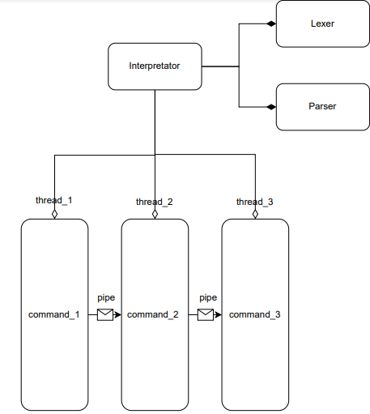
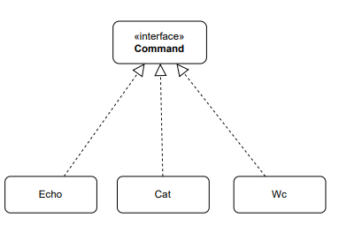

# Command Line Interface (CLI)

## System Architecture

<p align="center" width="100%">
    
</p>
<p align="center" width="100%">
    
</p>

## System design

- Основной класс `Interpretator`. Каждая входная строка обрабатывается лексером и парсером. 

- Лексер разбивает строку на токены: глобально мы разделяем строку на `n` команд, разделенных  `(n - 1)` пайпом (пайпов может и не быть). И уже каждая команда представляет собой ключевое слово - сама команда, плюс произвольное (возможно нулевое) количество аргументов. Присвоение переменных окружения тоже команда, у неё два аргумента - переменная и значение. 
Результат своей работы лексер отдает парсеру, который проверяет переданный набор токенов на корректность, выполняет подстановку переменных окружения, затем обрабатывает всё возвращает список, элементами которого являются команда с её аргументами. 

- Про переменные оболочки: есть инстанс класса `EnvVariables`. В нём хранится словарь для существующих переменных и их значений, а так же методы доступа к этому словарю.  Исследования баша показали, что в одном пайплайне нельзя использовать переменные окружения, которые в этом же пайплайне объявлены, в нашей реализации будет реализовано аналогичное поведение

- Сами команды запускаются параллельно в разных потоках, и output i-ой команды идёт в input (i + 1)-ой команды, соответственно input первой команды идет из stdin, а output n-ой команды идёт в stdout. Общение между потоками и процессами реализуется с помощью механизма пайпов

## Use cases

В нашей реализации мы считаем, что присваивание переменной оболочки - тоже является командой. Обобщённый пайплайн выглядит как `cmd_1 | cmd_2 | ... | cmd_n`. 

Исходя из этого, мы считаем, что явно запрещено объявление переменной оболочки и выполнение команды одновременно

```bash
# Строка ниже не является корректной

TEST=ls $TEST 
```

> By Alexander Vinogradov, Ivan Peshkov, Daniil Plotnikov, Artem Sidorenko
>
> **@** _The Higher School of Economics, third year Software Development group project, 2024_

